# ProjectManagerLight :open_file_folder:
In the project management business many tools were used to have an overview of tasks and time tables for different projects. The difficulty is having the right amount of information illustrated in a clear way.

“Project Manager Light” should combine different project management tools in one application, to give a basic overview of tasks and responsibilities for different projects. Furthermore with the software it should be possible to plan tasks only with essential information. Another advantage of the software should be the intuitive handling of it.

## Framework, Tools & Layered Architecture
* Java Version: JDK 8 
*	Development environment:	Eclipse
* Build Tool: Maven

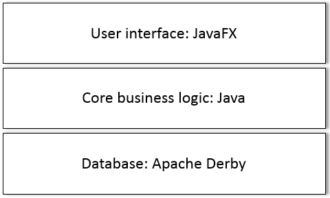

## Patterns & System Features
* MVC Pattern
* Database Controller through CRUD

## CopyAndRun Folder
To use ProjectManagerLight (tested on Windows):
1. Install Java 8 (jre1.8.0_191 or higher)
2. Download the "CopyAndRun"-Folder 
3. Open the folder 
  - Double-click on project.jar 
 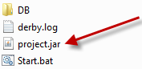 

  - or double-click on "Start.bat" (for Windows)  
 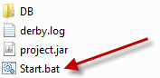 

4. For the first login: 
>Username: **admin**
  Password: **password** 
 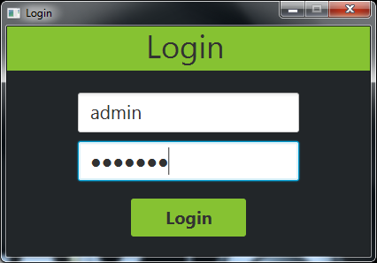 

5. Have fun :)

## User Interface (Wireframe protoype)
### Login Screen

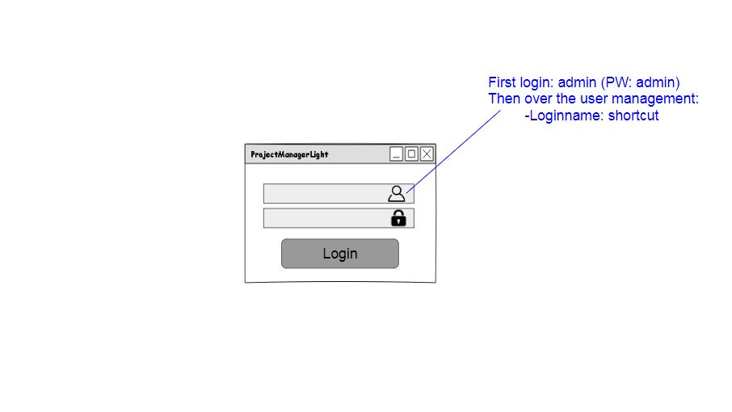

### Menu Navigation

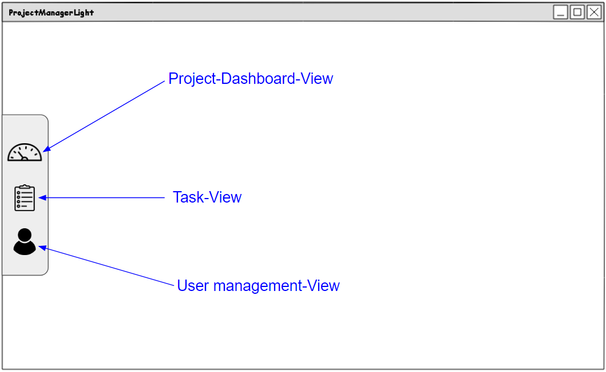

### Project View

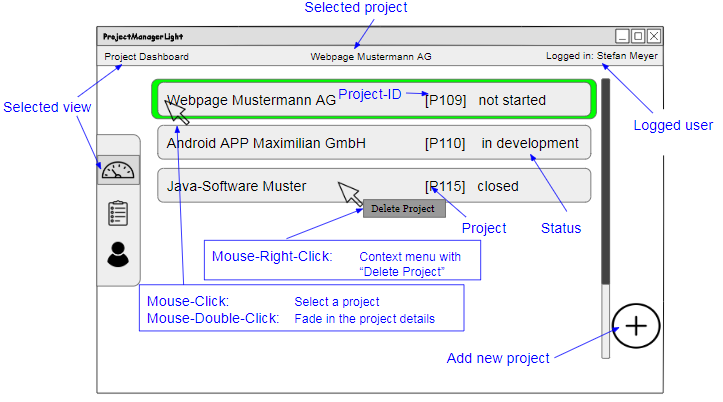

### Project View - Detail Main Window

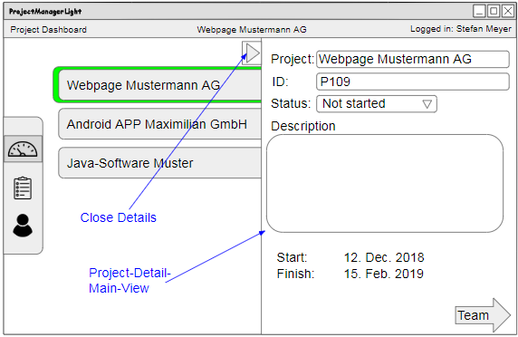

### Project View - Detail Team Window

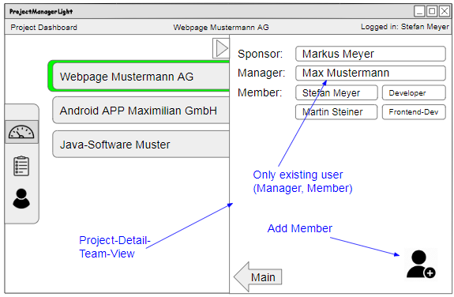

### Task View

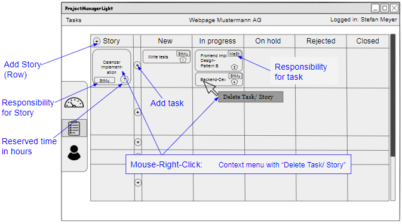

### Task View - Details

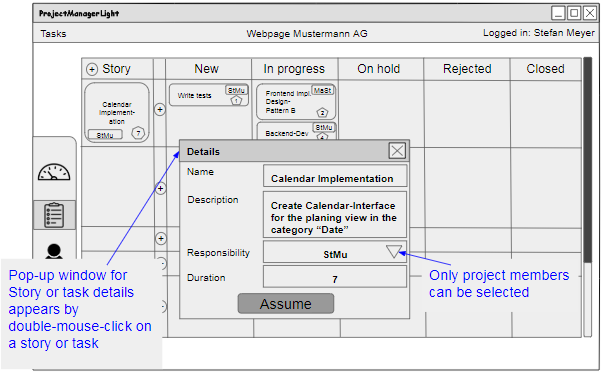

### User Management View

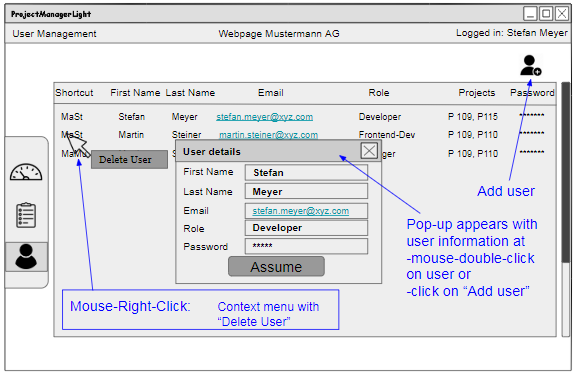

## Activity diagram

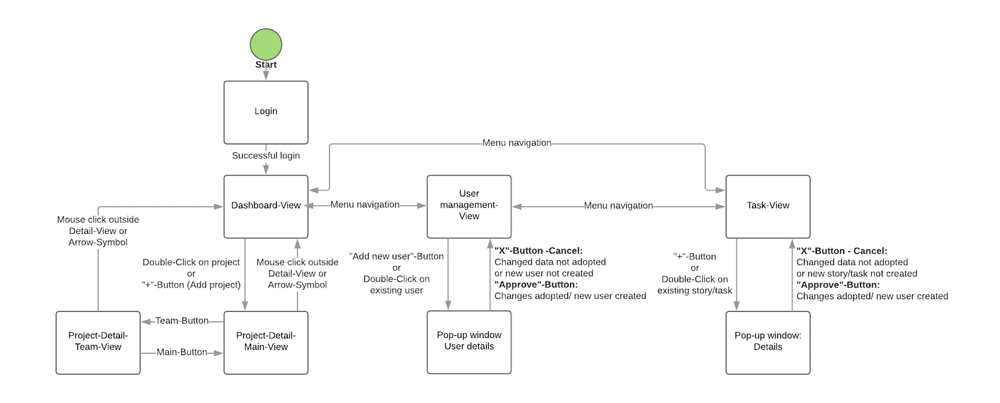

## ERD-Database model

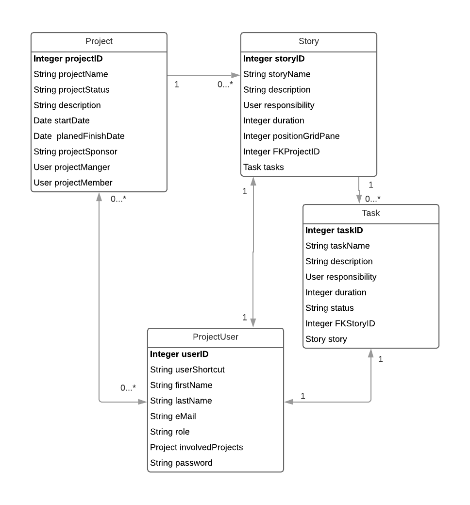

